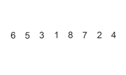
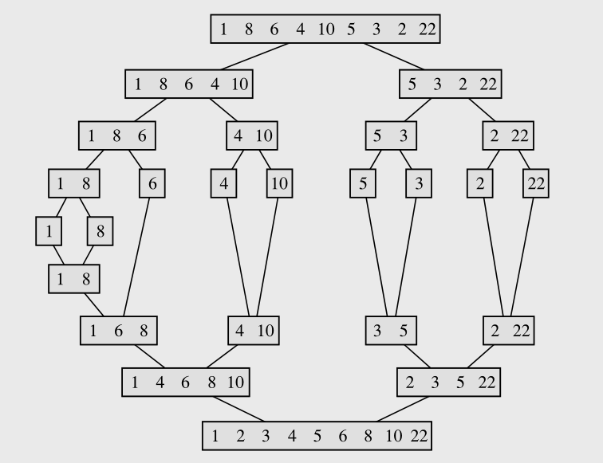

# Búsqueda en Estructuras de Datos Lineales

La búsqueda es una operación común en la programación. En esta sección vamos a explorar cómo llevar a cabo la búsqueda en estructuras de datos **lineales** con Java. Recordemos que estas estrategias de búsqueda aplican tanto para arreglos nativos como estructuras dinámicas.

## El tema de la igualdad
Recordemos que para buscar un elemento en un arreglo debemos definir el **criterio de igualdad** para el tipo de datos de los elementos. En el caso de tipos primitivos (int, double, etc) o sus tipos de referencia que los encapsulan (Integer, Double, etc), podemos apoyarnos en el operador de igualdad `==` ya que estaremos realizando la comparación correcta sobre el literal evaluado de estas variables. Pero si tenemos un arreglo de otro tipo de referencia tendremos que **sobreescribir** los métodos `equals` y `hashCode`, según lo vimos en [la sección de Igualdad](../04_igualdad_y_copia/README.md#igualdad).

Por ejemplo, si tenemos un arreglo de _Persona_, si no implementamos nuestro criterio de igualdad, sólo podremos buscar objetos idénticos (misma referencia) en un arreglo. Probablemente, no sea lo que deseamos.

## Búsqueda Lineal
La búsqueda lineal es un enfoque simple pero efectivo para buscar un elemento en una estructura de datos. Consiste en recorrer todos los elementos uno por uno hasta encontrar el elemento buscado. 

Veamos un ejemplo de cómo realizar una búsqueda lineal en un arreglo nativo en Java.

```java
public static int busquedaLineal(int[] arreglo, int elemento) {
    for (int i = 0; i < arreglo.length; i++) {
        if (arreglo[i] == elemento) {
            return i;   // Elemento encontrado, se devuelve la posición
        }
    }
    return -1;          // Elemento no encontrado, se devuelve -1
}
```
En el ejemplo, podríamos reemplazar la comparación con el `equals` para arreglos de tipos de referencia.

```java
if (arreglo[i] != null && arreglo[i].equals(elemento))
```

Este algoritmo es útil cuando los elementos **no están necesariamente ordenados** y es eficaz para **estructuras pequeñas**. El motivo de esto último se debe a que el algoritmo tiene un **orden de complejidad lineal**, **O(n)**, porque requiere (en el peor caso) recorrer cada elemento del arreglo.

### Ejercicio: Búsqueda lineal genérica
Implementar un **método genérico** de búsqueda lineal que permita recibir un arreglo y un elemento a buscar de cualquier tipo de dato (`T`). Contemplar el uso del `equals`.

## Búsqueda Binaria

La búsqueda binaria es un algoritmo más eficiente que la búsqueda lineal, pero requiere que **los elementos estén ordenados**. Funciona dividiendo repetidamente la estructura de datos en dos mitades y comparando el elemento buscado con el elemento central. Si el elemento es menor, continúa buscando en la primera mitad, mientras que si es mayor lo hace en la segunda. 

Veamos un ejemplo de cómo realizar una búsqueda binaria en un arreglo ordenado en Java.

```java
public static int busquedaBinaria(int[] arreglo, int elemento) {
    int inicio = 0;
    int fin = arreglo.length - 1;

    while (inicio <= fin) {
        int medio = inicio + (fin - inicio) / 2;

        if (arreglo[medio] == elemento) {
            return medio;   // Elemento encontrado, se devuelve la posición
        }

        if (arreglo[medio] < elemento) {
            inicio = medio + 1;
        } else {
            fin = medio - 1;
        }
    }

    return -1;              // Elemento no encontrado, se devuelve -1
}
```

En este caso optamos por una versión iterativa, pero tranquilamente podemos hacerlo con una versión recursiva. En cada iteración obtenemos la posición del centro del arreglo (`medio`) y verificamos si el elemento de esa posición coincide con el buscado. Caso contrario, desplazamos el `inicio` o `fin` según la mitad donde se pueda encontrar el elemento para continuar iterando.

La búsqueda binaria es **muy eficiente en estructuras de datos ordenadas**, ya que reduce el número de comparaciones requeridas significativamente. Su complejidad es **O(log n)**, lo que lo hace ideal para grandes conjuntos de datos.

### Ejercicio: Búsqueda binaria genérica
Implementar un **método genérico** de búsqueda binaria que permita recibir una lista (`List<T>`) y un elemento a buscar de cualquier tipo de dato (`T`). Contemplar el uso del `equals`.

# Ordenamiento

El ordenamiento de arreglos es una tarea que se realiza con frecuencia para organizar los elementos dentro de una estructura. De esta forma podremos buscar un elemento de forma más eficiente, por ejemplo, utilizando la búsqueda binaria. En esta sección veremos algunos algoritmos: Bubble Sort, Selection Sort, Insertion Sort, Merge Sort y Quick Sort.

## Elementos comparables
Recordemos que para ordenar un arreglo debemos definir el **criterio de orden** para el tipo de datos de los elementos, de forma que respete la relación de orden entre los elementos que estamos colocando en la colección. En el caso de tipos primitivos (int, double, etc) o sus tipos de referencia que los encapsulan (Integer, Double, etc), podemos apoyarnos en los operadores clásicos (`>`, `<`, `>=`, etc) ya que estaremos realizando la comparación numérica sobre el literal evaluado de estas variables. Pero si tenemos un arreglo de otro tipo de referencia tendremos que utilizar alguna otra estrategia para compararlos. Por ejemplo, **implementando la interfaz `Comparable<T>`**, según lo vimos en [la sección de Ordenando elementos](../04_igualdad_y_copia/README.md#ordenando-elementos). En ese caso, usaríamos el método `compareTo`, en lugar de los operadores de orden.

Por ejemplo, la clase `String` implementa la interfaz `Comparable<String>` y, por lo tanto, define el método `compareTo` de forma que compara el orden lexicográfico de cadenas.

## Estabilidad de algoritmos
En general, tanto la igualdad como el orden se suelen establecer sobre un **subconjunto del estado de un objeto**. Recordemos que podríamos tener diferentes objetos que sean iguales, pero no idénticos. Todo depende de cómo definamos el criterio de igualdad cuando sobreescibimos `equals` y `hashCode`.

En el caso de la relación de orden es posible que deseemos definirla con otro criterio (denominada comúnmente _key_), utilizando otros atributos del objeto para compararlo. Aunque recordemos que esto no es recomendable con la interfaz `Comparable<T>`, ver [la restricción del compareTo](../04_igualdad_y_copia/README.md#restricciones-del-compareto). Aún si respetásemos la condición de `(x.compareTo(y)==0) == x.equals(y)` para el tipo de datos de elementos, podríamos tener varios objetos que cumplan con el criterio de igualdad en una misma colección. Entonces, podemos clasificar los algoritmos de orden según cómo tratan estos elementos _iguales_ o de mismo nivel de orden (misma _key_).

- **Algoritmos estables**: Mantienen los elementos _iguales_ en el mismo orden que en la colección original.
- **Algoritmos inestables**: No garantizan que los elementos _iguales_ queden en el mismo orden que en la colección original.

> Tengamos en cuenta que esto es aplicable cuando la relación de igualdad/orden se define sobre cierta **información parcial** del elemento, no así cuando se computa con todos los atributos del objeto (serían elementos idénticos). Tampoco es relevante la estabilidad cuando tenemos colecciones sin elementos iguales.

Por ejemplo, si estamos registrando lanzamientos de un dado en una colección y luego deseamos ordenarlos por el número obtenido, veremos que un algoritmo estable devuelve los lanzamientos ordenados como segundo criterio. Si lanzáramos 4 veces el dado y obtenemos los números [3, 2, 4, 3], luego de ordenar con un estable tendremos [2, 3, 3, 4], donde el _3_ que aparece primero será el del lanzamiento inicial y el _3_ que aparece después será el del último lanzamiento.

## Bubble Sort
El ordenamiento de burbuja o _burbujeo_ es un algoritmo **simple pero ineficiente**. Funciona comparando pares de elementos adyacentes y los intercambia si están en el orden incorrecto, por lo cual es **estable**. Este proceso se repite hasta que ningún intercambio es necesario. 

### Eficiencia
En el peor caso (y en el caso promedio también) tiene un orden de complejidad **O(n^2)**. Esto significa que el número de comparaciones y movimientos de elementos es **cuadrático en relación al tamaño del arreglo**. Es uno de los algoritmos más ineficientes.

### Procedimiento


1. Comenzamos comparando el primer elemento con el segundo elemento del arreglo.
2. Si el primer elemento es mayor que el segundo, los intercambiamos.
3. Comparamos el segundo elemento con el tercero y realizamos el intercambio si es necesario.
4. Continuamos este proceso hasta el final del arreglo.
5. Repetimos los pasos 1 a 4 hasta que no se realicen intercambios en una pasada completa por el arreglo.

### Ejemplo en Java

```java
public void bubbleSort(int[] arreglo) {
    int n = arreglo.length;
    boolean huboCambio;
    do {
        huboCambio = false;
        for (int i = 1; i < n; i++) {
            if (arreglo[i - 1] > arreglo[i]) {
                // Intercambia arreglo[i-1] y arreglo[i]
                int temp = arreglo[i - 1];
                arreglo[i - 1] = arreglo[i];
                arreglo[i] = temp;
                huboCambio = true;
            }
        }
        n--;
    } while (huboCambio);
}
```

Si quisiéramos utilizar el `compareTo` para ordenar arreglos de cualquier tipo de referencia, cambiaríamos la condición del `if` así:

```java
if (arreglo[i - 1] != null && arreglo[i - 1].compareTo(arreglo[i]) > 0)
```

## Selection Sort
El ordenamiento por selección encuentra el elemento mínimo desde la parte no ordenada del arreglo y lo coloca al principio. Luego, repite el proceso para el resto de los elementos. 

### Eficiencia
En el peor caso tiene un orden de complejidad **O(n^2)**, similar al Bubble Sort, ya que también involucra un número cuadrático de comparaciones y movimientos de elementos.

### Procedimiento


1. Inicialmente el arreglo se divide en dos partes: la parte ordenada y la parte no ordenada.
2. Buscamos el elemento mínimo en la parte no ordenada.
3. Intercambiamos el elemento mínimo con el primer elemento de la parte no ordenada, y pasa a ser parte de la sección ordenada. Por ese intercambio es un algoritmo **inestable**.
4. Repetimos los pasos 2 y 3 para el resto de los elementos, cada vez disminuyendo la parte no ordenada y aumentando la parte ordenada.

### Ejemplo en Java

```java
public void selectionSort(int[] arreglo) {
    int n = arreglo.length;
    for (int i = 0; i < n - 1; i++) {
        int idxMinimo = i;
        for (int j = i + 1; j < n; j++) {
            if (arreglo[j] < arreglo[idxMinimo]) {
                idxMinimo = j;
            }
        }
        // Intercambia el mínimo encontrado con el elemento en la posición i
        int temp = arreglo[i];
        arreglo[i] = arreglo[idxMinimo];
        arreglo[idxMinimo] = temp;
    }
}
```
Similar a lo visto antes, si quisiéramos utilizar el `compareTo` para ordenar arreglos de cualquier tipo de referencia, cambiaríamos la condición del `if` así:

```java
if (arreglo[j] != null && arreglo[j].compareTo(arreglo[idxMinimo]) < 0)
```

## Insertion Sort
El ordenamiento por inserción construye una parte ordenada del arreglo de a un elemento a la vez. El proceso es análogo a ordenar un mazo de cartas. Comienza con un solo elemento y lo va insertando en la posición correcta en la parte ordenada. Dado que no se intercambian elementos, es un algoritmo **estable**.

### Eficiencia

Al igual que los algoritmos previos, es de orden **O(n^2)**, porque en el peor caso implica un número cuadrático de operaciones, pero en la práctica funciona mejor que los anteriores. Es eficiente para arreglos pequeños o parcialmente ordenados.

### Procedimiento



1. Inicialmente el primer elemento se considera como la parte ordenada.
2. Tomamos el siguiente elemento en la parte no ordenada y lo comparamos con los elementos en la parte ordenada.
3. Si el elemento que tomamos es menor que el elemento actual en la parte ordenada, movemos el elemento actual hacia la derecha.
4. Repetimos el paso 3 hasta encontrar la posición adecuada para el elemento en la parte ordenada.
5. Continuamos con el siguiente elemento en la parte no ordenada y repetimos los pasos 2-4 hasta que todo el arreglo esté ordenado.

### Ejemplo en Java

```java
public void insertionSort(int[] arreglo) {
    int n = arreglo.length;
    for (int i = 1; i < n; i++) {
        int aInsertar = arreglo[i];
        int j = i - 1;
        while (j >= 0 && aInsertar < arreglo[j]) {
            // Movemos a la derecha el elemento actual
            arreglo[j + 1] = arreglo[j];
            j--;
        }
        arreglo[j + 1] = aInsertar;
    }
}
```

## Merge Sort
El ordenamiento por mezcla es un algoritmo que utiliza la estrategia _divide & conquer_ ya que divide el arreglo en mitades, ordena cada mitad y luego combina (_merge_) las dos mitades ordenadas intercalando los elementos. 

### Eficiencia

En el peor caso, su complejidad es de orden **O(n log n)**, lo cual ofrece un mejor rendimiento que los algoritmos anteriores. Debido a su naturaleza recursiva, es posible paralelizarlo.

### Procedimiento


1. Dividimos el arreglo en dos mitades (una izquierda y otra derecha), si tiene más de un elemento, de lo contrario ya está ordenado.
2. Ordenamos recursivamente ambas mitades utilizando el mismo algoritmo.
3. Fusionamos las dos mitades ordenadas en un solo arreglo ordenado.



El desafío de este algoritmo se encuentra en el paso 3. La fusión se realiza comparando los elementos en ambas mitades (apoyándonos en arreglos temporales), para luego ubicarlos con el orden correcto al arreglo original. Debido a que no se intercambian elementos, es un algoritmo **estable**.

### Ejemplo en Java

```java
public void mergeSort(int[] arreglo) {
    mergeSortRec(arreglo, 0, arreglo.length - 1);
}

public void mergeSortRec(int[] arreglo, int inicio, int fin) {
    if (inicio < fin) {
        int medio = (inicio + fin) / 2;
        mergeSortRec(arreglo, inicio, medio);       // Ordena parte izquierda
        mergeSortRec(arreglo, medio + 1, fin);      // Ordena parte derecha
        merge(arreglo, inicio, medio, fin);         // Fusiona las partes
    }
}

public void merge(int[] arreglo, int inicio, int medio, int fin) {
    int[] izquierda = new int[medio - inicio + 1];
    int[] derecha = new int[fin - medio];

    for (int i = 0; i < izquierda.length; i++) {
        izquierda[i] = arreglo[inicio + i];
    }
    for (int i = 0; i < derecha.length; i++) {
        derecha[i] = arreglo[medio + 1 + i];
    }

    int i = 0, j = 0, k = inicio;
    while (i < izquierda.length && j < derecha.length) {
        if (izquierda[i] <= derecha[j]) {
            arreglo[k++] = izquierda[i++];
        } else {
            arreglo[k++] = derecha[j++];
        }
    }

    while (i < izquierda.length) {
        arreglo[k++] = izquierda[i++];
    }

    while (j < derecha.length) {
        arreglo[k++] = derecha[j++];
    }
}
```

Una consideración importante para este algoritmo es que, dado que utiliza arreglos temporales para almacenar las partes, requiere **memoria adicional** suficiente para almacenar los _n_ elementos temporales. Es decir, necesitamos duplicar el espacio que ocupa el arreglo original.

## Quick Sort
El ordenamiento rápido es otro algoritmo que utiliza la estrategia _divide & conquer_. Selecciona un elemento llamado _pivote_ y reorganiza el arreglo de modo que los elementos menores que el _pivote_ estén a la izquierda y los elementos mayores estén a la derecha. De esta forma, el elemento _pivote_ queda ordenado en su posición final dentro del arreglo. Esta reorganización produce que sea un algoritmo **inestable**.

### Eficiencia

En el peor caso, el _pivote_ elegido divide el arreglo de manera desequilibrada, produciendo así un costo cuadrático, **O(n^2)**. Sin embargo, en el caso promedio, Quick Sort tiene un rendimiento de **O(n log n)** y en la práctica puede ser más eficiente que el Merge Sort. A diferencia de este último, todo el proceso se realiza sobre el mismo arreglo (_in place_), sin generar estructuras temporales, por lo cual también es más eficiente en términos de **espacio**.

### Procedimiento


1. Seleccionamos un elemento como _pivote_, generalmente el último elemento del arreglo, aunque existen diversas estrategias.
2. Reorganizamos el arreglo de modo que los elementos menores que el _pivote_ estén a la izquierda y los elementos mayores estén a la derecha del _pivote_. Esto se hace mediante un proceso de partición, donde el _pivote_ queda ordenado en su posición final.
3. Aplicamos el mismo proceso (pasos 1-2) a las dos subpartes generadas de forma recursiva.

### Ejemplo en Java

```java
public void quickSort(int[] arreglo) {
    quickSortRec(arreglo, 0, arreglo.length - 1);
}

public void quickSortRec(int[] arreglo, int inicio, int fin) {
    if (inicio < fin) {
        int indicePivot = partition(arreglo, inicio, fin);
        quickSortRec(arreglo, inicio, indicePivot - 1);
        quickSortRec(arreglo, indicePivot + 1, fin);
    }
}

public static int partition(int[] arreglo, int inicio, int fin) {
    int pivot = arreglo[fin];   // El último elemento como pivote
    int i = inicio;
    int j = fin - 1;

    while (i <= j) {        
        while (i <= j && arreglo[i] <= pivot) {
            i++;
        }
        while (i <= j && arreglo[j] > pivot) {
            j--;
        }
        if (i < j) {
            // Intercambiamos arreglo[i] y arreglo[j]
            int temp = arreglo[i];
            arreglo[i++] = arreglo[j];
            arreglo[j--] = temp;
        }
    }
    
    // Intercambiamos arreglo[fin] y arreglo[i]
    int temp = arreglo[fin];
    arreglo[fin] = arreglo[i];
    arreglo[i] = temp;
    return i; // Devolvemos la posición del pivote después de la partición
}
```

En esta implementación de la operación `partition`, establecemos como _pivote_ al último elemento e inicializamos dos índices: `i` y `j`. El primero se coloca al inicio del arreglo, mientras que el otro en la penúltima posición (el último elemento es el _pivote_). Luego, comenzamos a mover los índices en dirección mutua hasta que encontramos un intercambio de elementos a realizar, es decir, cuando la posición `i` tiene un elemento mayor al _pivote_ y la posición `j` un elemento menor. Si sucede esa situación se realiza el intercambio hasta que no haya más elementos a desplazar a su partición, cuando los índices se cruzan (`i > j`). Finalmente, se intercambia el _pivote_ con el primer elemento de la partición de la derecha (mayores), el cual pasa a la última posición.

## Lectura de interés
> - [VisuAlgo](https://visualgo.net/en/sorting)
> - _Estructura de datos y algoritmos en Java. 2nd ed (2007), DROZDEK, A._
>   - Capítulo 2: Complexity Analysis
>   - Capítulo 9: Sorting